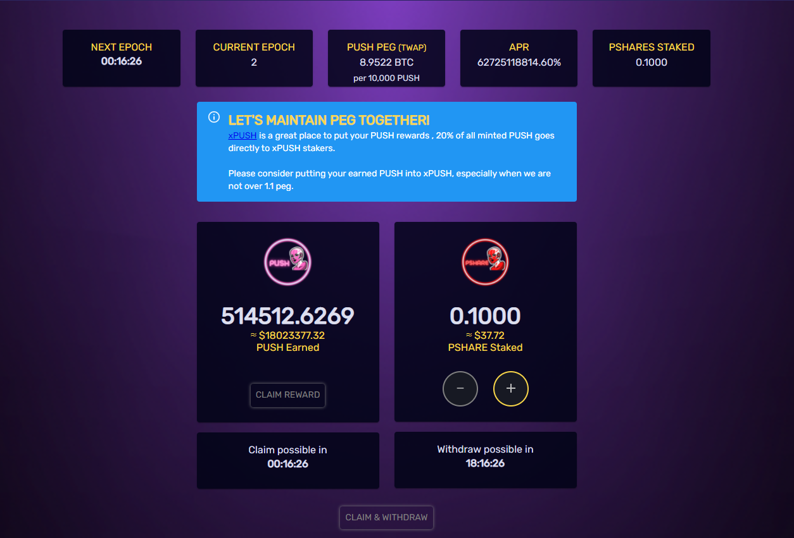

# Boardroom

## The Boardroom User Interface

Let's take a look at each element of the Boardroom user interface and what it means.

1. **NEXT EPOCH**\
   The amount of time remaining until the next epoch.
2. **CURRENT EPOCH**\
   The number of the current epoch.
3. **PUSH PEG (TWAP)**\
   The TWAP (time-weighted average price) of the PUSH peg. The Boardroom only mints new PUSH as rewards for PSHARE stakers when this value **is above 1.01** **at the end of the current epoch**.
4. **APR**\
   The yield for PSHARE stakers in the Boardroom **if the Boardroom was printing every epoch**. This calculation is based on **the last recorded print in the Boardroom**.
5. **PSHARES STAKED**\
   \*\*\*\*The total amount of PSHARE currently staked in the Boardroom.
6. **PUSH Earned**\
   \*\*\*\*The amount of PUSH you've earned as rewards for staking PSHARE in the Boardroom.
7. **PSHARE Staked**\
   The amount of PSHARE you currently have staked in the Boardroom.

### Boardroom Specifications

* Epoch duration: 6 hours
* Any interaction with the Boardroom (staking/unstaking PSHARE or withdrawing PUSH rewards) will **lock your staked PSHARE for 6 epochs and PUSH rewards for 3 epochs.**
*   Distribution of PUSH during expansion (Boardoom printing):

    **60%** goes to Boardroom PSHARE stakers as rewards\
    **20%** goes to PUSH stakers (xPUSH)

    **10%** goes to DAO fund

    **10%** goes to dev fund
* Epoch Expansion: The current expansion cap is based on the currently circulating PUSH supply (see [PUSH Distribution](push-distribution.md) for details). If there are bonds to be redeemed, 65% of minted PUSH goes to the treasury until its sufficiently stocked to satisfy future bond redemption.


Note that the Boardroom **does not** print any rewards for PSHARE stakers when the Boardroom TWAP < 1.01.


## Boardroom FAQ

### **1. Once PBONDs are issued, does the Boardroom stop printing PUSH until we are above peg again?**

Staking PSHARE will only give you PUSH rewards when the price of PUSH is above the peg (10,000 PUSH to 1 BTC), but not when it is under the peg.

### **2. What happens if I interact with the Boardroom in any way? Are there any lockup periods?**

Yes, there are two lockup timers. One for PUSH rewards and one for staked PSHARE. **Any interaction with the Boardroom will reset both timers.** The lockup period for withdrawing PUSH rewards is **3 epochs (18 hours)**, or **6 epochs (36 hours)** to unstake your PSHARE.

### **3. Are the Boardroom rewards pro-rated by time? For example, if I stake three hours before the end of an epoch versus five hours before the end of an epoch, would I get different rewards?**

No, Boardroom rewards are determined by how much you have staked at the time of printing (i.e., at the end of one epoch and the start of the other). It doesn't matter if you stake three hours before or thirty seconds before the emissions occur.

### 4. If I remove my PSHARE from the Boardroom without first collecting my PUSH, will they be lost forever?

No, they will still be there to collect whenever you need.

### 5. The Boardroom APR dropped because we're in a "debt phase." What does that mean?

A debt phase takes place during expansion epochs that start after a contraction period where there are still PBOND to be redeemed.

65% of expansion during a debt phase is allocated to the treasury fund to prepare for subsequent PBOND redemption down the road. This amount is always reserved, regardless of whether PBOND holders are redeeming bonds or not.

Once enough PUSH is sufficiently stocked in the treasury to satisfy the redemption of all circulating PBOND, expansion rates will resume to normal.

### 6. If we're in a debt phase, how long will it last until the Boardroom continues printing as normal?

The debt phase will last as long as is necessary to adequately pay back outstanding PBOND debt. Please keep in mind that the DAO will also need to collect a little extra, as there needs to be a cushion to cover the bonus premiums when people redeem PBOND over peg.\
\
There's no exact way of calculating how many epochs it will take, since the protocol doesn't know exactly when people will redeem their PBOND. The debt phase cannot end until the treasury has enough PUSH to cover the redemption of all outstanding PBONDs plus a premium.

### 7. At the end of the epoch, the Boardroom did not print PUSH, but then no PBOND(s) were issued either. Why?

There is a balanced state "at peg" when PUSH's TWAP is between 1.00 and 1.01, which results in no contraction or expansion of the circulating supply of PUSH. This is referred to as a **zen epoch**.

### 8. If PUSH continues to climb above the price of the peg, will that influence how long the debt phase lasts?

Depending on the price of PUSH, the Boardroom print will have to adjust to provide a buffer for any unclaimed PBOND. As the price of PUSH climbs above the peg, more PUSH needs to be distributed to the treasury to account for PBOND redemption plus premiums.

### 9. How can I figure out what my future PUSH rewards will be from the Boardroom?

Let's take a look at a simplified example for a _non-debt phase_: say you have 1 PSHARE staked out of 10 total PSHAREs staked in the Boardroom. In this case, you will receive 10% of the total PUSH printed in the Boardroom.

For this example we are assuming that there is a total circulating supply of 10,000 PUSH and the current expansion rate is at 4%, so a total of 400 PUSH will be printed in the Boardroom. Under the protocol's current rules, 60% of those newly printed PUSH will be distributed to PSHARE stakers in the Boardroom. (See the [PUSH Distribution](push-distribution.md) page for more details on how PUSH is distributed within the protocol.)\
\
Therefore, you would get: ((0.04 _\*_ 10000) _\*_ 0.6) \* (1/10) = **24 PUSH**.\
\
Thus, the formula to calculate your rewards is as follows:\
((_ExpansionRate_ \* _CirculatingPUSHSupply)_ \* 0.6) \* (_YourPShareStake_ / _TotalPShareStaked_)

### 10. How long will it take for PSHARE to pay itself off from PUSH rewards based on current prices?

This will vary constantly as the APR in the Boardroom fluctuates, along with other variables such as the price of PUSH.

For a quick estimation, however, you can do the following:

1. Take the total APR shown in the Boardroom and divide that by 365 to get the daily APR. (For this example we will say the daily APR is 5%.)

2. Multiply that daily APR by the current market price of the total PSHARE you have staked to see what your daily rewards are. (In this example, we have 5 PSHARE, each worth $500, for a total amount staked of $2500. Your daily return in this case would be $2500 \* 0.05, which comes out to $125 per day.)
3. Take your initial buy-in price for PSHARE and divide it by your daily rewards. If you bought these 5 PSHARE at a higher price, say $700 for example, in the current market conditions you would recover your initial investment of $3500 in 3500/125 or 28 days.
