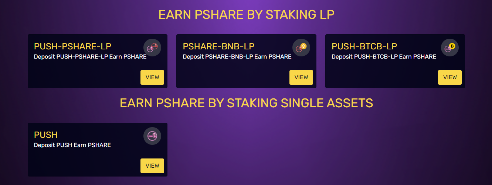

# Farms

To incentivize healthy liquidity pools for the Push Money protocol tokens, our LP farms have been seeded with PSHARE to be distributed as rewards to LP stakers across a time period of 12 months. The total PSHARE rewards are distributed from each farm as follows:

* PUSH-BTCB LP: 50% of PSHARE rewards
* PSHARE-BNB LP: 20% of PSHARE rewards
* PUSH-PSHARE LP: 20% of PSHARE rewards
* PUSH : 10% of PSHARE rewards

### **1. What will happen when the circulating supply equals the total supply? Will reward emissions stop?**

Yes. Once the max supply of PSHARE (59.5K) is reached, reward emissions end. This will happen in exactly one year from when the PSHARE farms started on March 21th, 2022. PSHARE will always continue to print PUSH in the Boardroom, though, as long as PUSH remains above peg.


PSHARE reward emissions for the current LP farms are scheduled to end on March 21th, 2023 once the total PSHARE supply has been distributed.


### 2. Why is "at-peg" (TWAP between 1.00 and 1.01) the best time to provide liquidity?

When PUSH is pegged or close to being pegged at 10,000 PUSH to 1 BTC, it is more akin to having exposure to a single asset (single staking) than to your traditional LP'ing experience, where you would run the risk of impermanent loss if one of the tokens went up in value and the other did not.

### 3. Wait, you mean that if BTC pumps, PUSH pumps with it?

**Yes!**\
\
Let's look at an example:\
\
If BTC pumps in price, it won't "outrun" PUSH, even if nobody is buying PUSH at that time.\
\
The farm APRs will vary in terms of USD value, but the emissions won’t. This is something that wouldn't be possible with another 1:1 pegged asset like a stablecoin LP position, where the USD value is directly tied to the emissions. If BTC rises in USD value, PUSH goes with it. Similarly, if BTC falls in USD value, PUSH will be worth less in USD, **but it won’t affect the peg**.


The only thing that can change the price of PUSH in terms of its BTC value (and as such, the peg) is buying and selling it.

