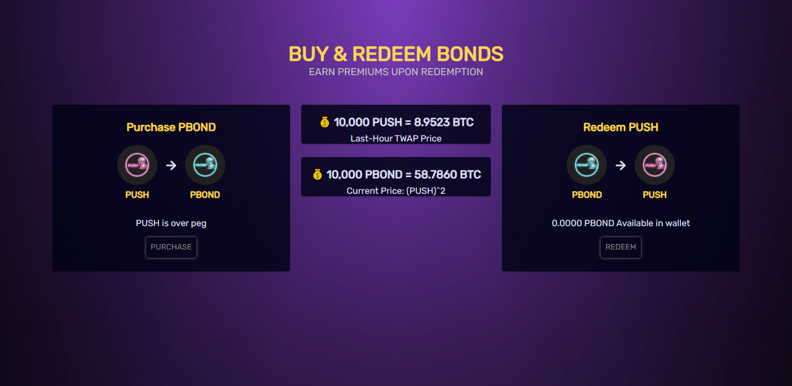

# Pushes (PBOND)

### What are PBOND (Bonds)?

Bonds are unique tokens that can be utilized to help stabilize PUSH price around peg (10,000 PUSH = 1 BTC) by reducing the circulating supply of PUSH if the TWAP (time-weighted average price) goes below peg.

### When can I buy PBOND (Bonds)?

PBOND can be purchased only during periods of supply contraction and when the TWAP of PUSH is below 1.

At the beginning of every new epoch during contraction periods, PBONDs are issued in the amount of 3% of PUSH's circulating supply, with a max debt amount of 35%. This means that if bonds reach 35% of the circulating supply of PUSH, no more bonds will be issued.


Note that during a zen epoch (when an epoch ends with a TWAP between 1.0 - 1.01), **no PBOND will be issued, even though the Boardroom does not print.**



PBOND TWAP (time-weighted average price) is based on the PUSH TWAP from the previous epoch as it ends. In other words, the PUSH TWAP is real-time but the PBOND TWAP is not.


### Where can I buy PBOND (Bonds)?

You can buy PBONDs if any are available through [push.money](https://app.bomb.money/bond) in the [Pit](https://app.bomb.money/bond). Anyone can buy as many PBONDs as they want as long as they have enough PUSH to pay for them.

There is a limit of available PBONDs per epoch during contraction periods (3% of PUSH's current circulating supply), and are sold first-come-first-serve.

### Why should I buy PBOND (Bonds)?

The first and most important reason to buy PBOND is that they help to maintain the peg, but they are not the only measure in place to keep the protocol on track.

PBONDs don't have an expiration date, so you can view them as an investment in the long-term health of the protocol to be redeemed for a premium at a later date.

#### Incentives for Holding PBOND

The idea is to reward PBOND buyers for helping the protocol, while also protecting the protocol from being manipulated by big players.

So after you buy PBOND using PUSH, you have two possible ways to get your PUSH back:

1. Sell back your PBOND for PUSH **while the peg is between 1 - 1.1** (10,000 PUSH = 1 BTCB) with no redemption bonus. This is in place to prevent an instant dump as soon as peg is recovered.
2. Sell back your PBOND for PUSH **while the peg is above 1.1** (10,000 PUSH = 1 BTCB) with a bonus redemption rate.

The longer you hold, the more both the protocol and you benefit from PBOND.


Example:

1. When PUSH = 0.8, burn 1 PUSH to get 1 PBOND (PBOND price = 0.8)
2. When PUSH = 1.15, redeem 1 PBOND to get 1.105 PUSH (PBOND price = 1.27)


So, which one is better?

If I buy PUSH at 0.8, and hold it until 1.15 and then sell, I'm getting +$0.35 per PUSH.

But, if I buy PUSH at 0.8, burn it for PBOND, and redeem it at 1.15, I'm getting 1.105 PUSH \* 1.15 (PUSH current price) = 1,271 (+$0.47) per PBOND redeemed.

But, what if getting back to peg is taking too long?

We will adjust our use cases to have different behaviors on contraction and expansion periods to benefit both PUSH and PBOND holders when needed.

### What is the formula to calculate the redemption bonus for PBOND?

To encourage the redemption of PBOND for PUSH when PUSH's TWAP > 1.1 and in order to incentivize users to redeem bonds at a higher price, PBOND redemption is designed to be more profitable with a higher PUSH TWAP value. The PBOND to PUSH ratio is 1:R, where R can be calculated using the formula as shown below:

$$
R=1+[(PUSHtwapprice)-1)*coeff)
$$

$$
coeff = 0.7
$$

### When can I swap PBOND for a premium?

You can only redeem PBONDs for a premium when the previous epoch's TWAP is greater than 1.1.
